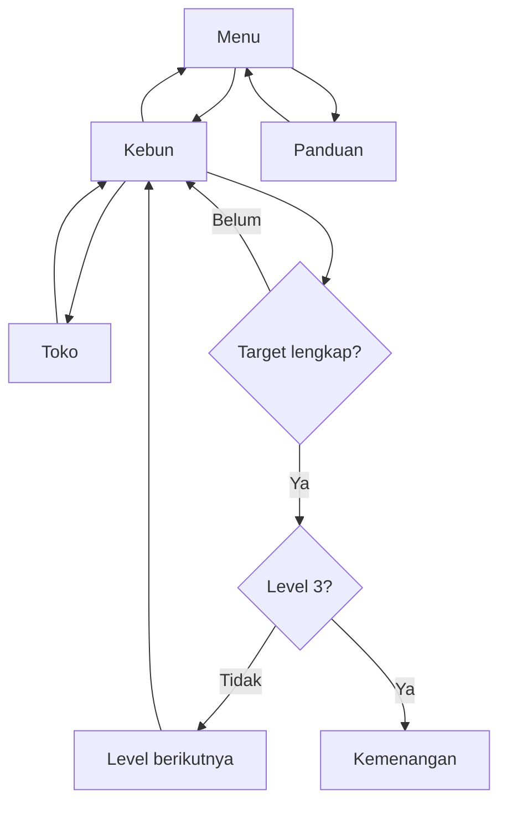

# Kebun Ceria 🌿

Game berkebun 2D untuk contoh **Pertemuan 3, STI7356 Pengembangan Aplikasi Game**: alur navigasi gameplay, asset, dan level. Menggunakan HTML, CSS, serta JavaScript murni tanpa instalasi dependensi, CDN, atau proses build.

## Cara bermain

1. Tekan **Mulai berkebun**, lalu pilih benih.
2. Klik atau sentuh petak kosong untuk menanam.
3. Klik tanaman untuk menyiram dengan satu unit air.
4. Tunggu sampai matang, lalu klik untuk memanen. Hasil panen otomatis terjual.
5. Beli benih di toko dan isi ulang air gratis di sumur.
6. Penuhi target kumulatif, lalu tekan **Buka level berikutnya**.

| Level | Tanaman baru | Target panen kumulatif |
|---|---|---|
| 1 — Kebun Pemula | Wortel | 3 wortel |
| 2 — Kebun Berkembang | Tomat | 5 wortel dan 3 tomat |
| 3 — Pesanan Pasar | Jagung | 7 wortel, 5 tomat, dan 3 jagung |

Wortel: benih 4 koin, jual 9 koin, tumbuh 6 detik. Tomat: 7/15 koin, 10 detik. Jagung: 10/22 koin, 14 detik. Pemain memulai dengan 30 koin, 3 benih wortel, dan 6 air. Bonus kenaikan level: 15 koin. Angka ini adalah parameter simulasi, bukan data pertanian nyata.

## Menjalankan

Unduh melalui **Code > Download ZIP**, ekstrak, lalu buka `index.html`. Alternatif: jalankan `python3 -m http.server 8000` dari folder proyek dan buka localhost port 8000.

Klik/sentuh bekerja pada komputer dan ponsel. Keyboard: Tab untuk berpindah tombol, Enter/Spasi untuk beraksi, Esc untuk menutup dialog. Penyimpanan otomatis memakai localStorage pada browser dan alamat yang sama. Tidak ada akun, server, atau pertumbuhan offline. Timer berhenti saat menu, dialog, atau tab lain dibuka. Jika storage diblokir, game tetap dapat dimainkan tanpa simpan permanen.

## GitHub Pages

Repositori berisi situs statis siap publikasi. Aktivasi dilakukan pemilik melalui **Settings > Pages > Build and deployment > Source: Deploy from a branch > main > /(root) > Save**. Tunggu proses publikasi selesai dan gunakan tautan yang ditampilkan GitHub. Mengunggah kode saja tidak mengaktifkan Pages. Tidak perlu menambahkan workflow custom.

## Pemetaan materi Pertemuan 3

| Materi | Implementasi | Lokasi |
|---|---|---|
| Navigasi menu | Menu utama, panduan, lanjutkan, kebun, toko, kemenangan | app.js |
| Core loop | Tanam, siram, tumbuh, panen, jual, beli benih | engine.js |
| Asset | Petak CSS, emoji tanaman, indikator air dan koin | index.html, style.css |
| State tanaman | Kosong, benih kering, disiram, matang | engine.js |
| Progresi level | Jenis tanaman dan target kumulatif meningkat | engine.js |
| Umpan balik | Pesan aksi, pertumbuhan, jumlah benih dan target | app.js |

## Struktur dan pengujian

- `index.html`: struktur antarmuka.
- `style.css`: tampilan responsif dan asset berbasis CSS.
- `engine.js`: aturan ekonomi, pertumbuhan, validasi save, dan level.
- `app.js`: interaksi, dialog, render, dan penyimpanan.
- `engine.test.cjs`: pengujian otomatis logika.

Jalankan `node --test engine.test.cjs`. Tes mencakup penanaman, pertumbuhan, panen, pembatasan pembelian, isi air, validasi simpan, dan penyelesaian tiga level. Pengujian logika tidak menggantikan uji visual pada browser.

## Latihan mahasiswa

1. Gambar flowchart siklus satu petak dan tambahkan kondisi air habis.
2. Buat asset list: nama, kategori, fungsi, dan state setiap objek.
3. Tambahkan tanaman keempat dengan biaya dan waktu tumbuh yang seimbang.
4. Ubah angka target, kemudian jalankan tes agar seluruh level tetap dapat diselesaikan.
5. Ganti emoji dengan sprite orisinal dan tuliskan sumber/lisensinya.

Visual saat ini menggunakan CSS dan emoji sistem, sehingga bentuk emoji dapat berbeda antarperangkat. Tidak ada asset eksternal atau audio pada versi ini. Game ini prototype edukasi, bukan simulasi pertanian realistis.
